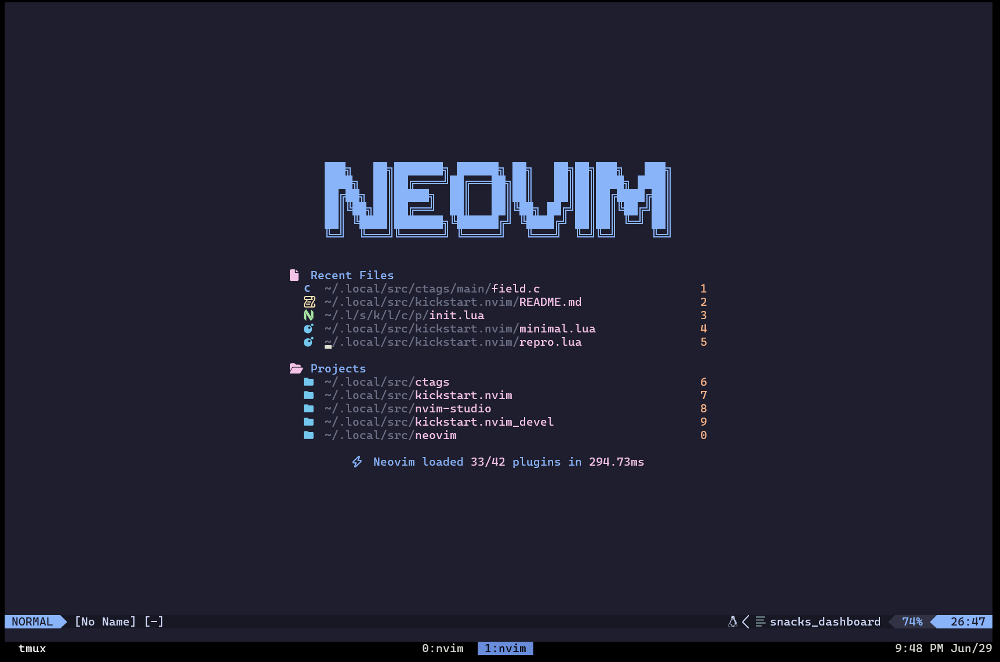
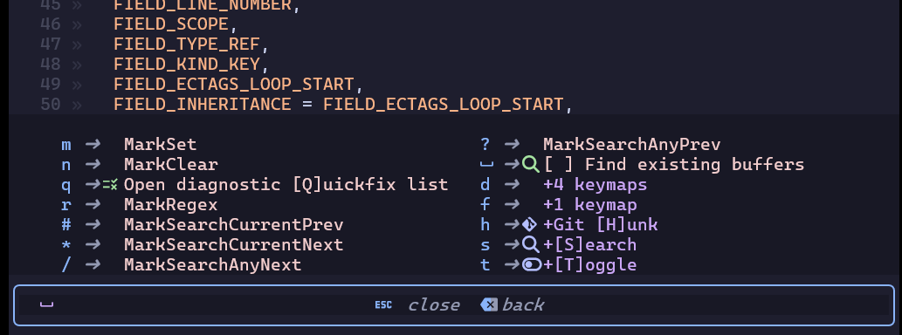

# Kickstart

If you are a VS Code user, I won’t say anything. However, if you are a Vim
user, you must use Neovim. The reason is that Neovim provides better plugins,
better UI, and most importantly LSP support. It’s not a stretch to say that
Neovim is the future.

That being said, Neovim has a steep learning curve even for Vim experts. This
is where Kickstart comes in. Kickstart will help you understand how to set
up Neovim, providing a starting point to foster your own setting. What's more,
on top of the original kickstart, I added my own setting.




## Features
* Session Management (via [persisted.nvim](https://github.com/olimorris/persisted.nvim))
  - Project-based session handling
  - No more hassle of manually opening files: Just open your project and your
    session is restored

* LSP support that provides:
  - Jump-to-definition, find-references and more powered by Telescope.  
  - Static analysis
    
  - Auto completion
    
  - Formatting

* Better highlighting

  

  Treesitter-based highlighting (left) vs Traditional highlighting (right)

* Git Integration

  

* Highlight marker

  

* Yank (copy) to the system clipboard and vice versa

  

* Markview that enriches markdown previews
  

* Which-key that helps you use key mappings
  


## Prerequisites

You should set up a good environment to make your neovim life easier. Neovim
is running in the following environments:

* Ubuntu 20.04 or above

* [Windows Terminal](https://docs.microsoft.com/en-us/windows/terminal/get-started)

* Set
  [CaskaydiaCoveNerdFont-Regular.ttf](https://github.com/ryanoasis/nerd-fonts/releases/download/v3.2.1/CascadiaCode.zip)
  by default to your terminal.


## Setting up the Environment

1. Install the following packages. It could be a overkill to install all
   packages. Some of them might not be necessary depending on your environment.
   However, note that if you encounter any unexpected symptom throughout this
   guide, come back here and see what is missing.

   ```bash
   sudo apt install ssh keychain make cmake python3-cryptography \
   clang-format automake autoconf pkg-config python3-pip clang \ 
   libtool-bin npm curl build-essential unzip gettext ninja-build \
   clang-tidy yacc libevent-dev bison libncurses-dev
   ```

2. Install [universal-ctags](https://github.com/universal-ctags/ctags)

   ```bash
   sudo apt-get install libjansson-dev
   mkdir ~/.local/src; cd ~/.local/src
   git clone https://github.com/universal-ctags/ctags.git --depth=1
   cd ctags
   ./autogen.sh
   ./configure --prefix=$HOME/.local/
   make
   make install
   ```

3. Install tmux

   I strongly recommend using tmux if you haven't already. If you have a root
   privilege, `sudo apt install tmux` will do. If the version is lower 
   than 3.2a in your Ubuntu or if you don't have a root privilege, you may 
   as well build tmux >= 3.2a to enjoy true color. libevent and ncurses are
   prerequisites. See [this page](https://github.com/tmux/tmux/wiki/Installing). 
   I describe the tmux build command as an example as follows:

   ```bash
   cd ~/.local/src
   git clone https://github.com/tmux/tmux.git
   cd tmux
   ./autogen.sh
   ./configure --prefix=${HOME}/.local \ 
   CFLAGS="-I${HOME}/.local/include \
   -I${HOME}/.local/include/ncurses" \
   LDFLAGS="-L${HOME}/.local/include \
   -L${HOME}/.local/include/ncurses -L${HOME}/.local/lib"
   make && make install
   ```

   Install tpm (Tmux Plugin Manager)

   ```bash
   cd
   wget https://raw.githubusercontent.com/guru245/dotfiles/refs/heads/main/.tmux.conf
   wget https://raw.githubusercontent.com/guru245/dotfiles/refs/heads/main/truecolor-test
   cd ~/.local/src
   git clone https://github.com/tmux-plugins/tpm ~/.tmux/plugins/tpm
   tmux
   ```

   Press `<leader>`, i.e., `Ctrl+a` in this setting and then press `I`
   (capital) to install tmux plugins. You may want to run 
   [`truecolor-test`](https://github.com/guru245/dotfiles/blob/main/truecolor-test) 
   to check if true color is working correctly.

4. Install misc packages for Neovim

   ```
   sudo apt install ripgrep fzf fd-find bear
   ln -s $(which fdfind) ~/.local/bin/fd
   ```


## Installing Neovim

```bash
sudo apt install ninja-build gettext cmake unzip curl build-essential
cd ~/.local/src
git clone https://github.com/neovim/neovim
cd neovim
git checkout tags/v0.11.1
make distclean <- if necessary
make deps <- if necessary
make CMAKE_EXTRA_FLAGS="-DCMAKE_INSTALL_PREFIX=${HOME}/.local" CMAKE_BUILD_TYPE=Release
rm -rf $VIMRUNTIME <- Mostly ~/.local/share/nvim/runtime
make install
pip3 install pynvim
```


## Installing Kickstart

```bash
cd ~/.local/src
git clone https://github.com/guru245/kickstart.nvim.git
cd
mkdir .config
ln -s ~/.local/src/kickstart.nvim ~/.config/nvim
nvim
```


## Setting up LSP

To enable LSP, you must install a language server that fits your language.
Run `:Mason` in the nvim commandline. Just then, you will see the following
screen.


You can select a LSP that you want to install by pressing `i`. If you encounter
an error, read the error message. You might need to install some dependent
packages such as *python3.10-venv*, etc. 

After installing the LSP, you need to specify the LSP name in init.lua as follows:

```lua
local servers = {
  clangd = {
    'clangd',
    '--clang-tidy',
  },
  pylsp = { },
  lua_ls = { }',
}
```
> [!Note]
> As for C or C++, you need to create 
> `compile_commands.json`. `compile_commands.json` can be created by *bear*.
> You can [see how to use
> bear](https://github.com/rizsotto/Bear?tab=readme-ov-file#how-to-use).
> When you succeed in creating the json file, you are ready to move on.


## Basic Usage

* `F1`: Which key that shows key mappings

* `F2`: Save the current file

* `F3`: Toggle tagbar, source code browser on the left side

* `Esc`: Clear all marks

* `alt+,`, `alt+.`: Go to the tab on the left/right

* `alt+h`, `alt+l`, `alt+k`, `alt+j`:  Move between nvim panes

* `alt+c`: Save and close the current buffer.

* `<leader>m`: Mark the keyword under the cursor. See more mappings [here](https://github.com/inkarkat/vim-mark?tab=readme-ov-file#usage)
* `K`: Shows a function prototype in a pop up.

  

* `[d` and `]d`: Prev/Next diagnostic message.


## Tmux Usage

You can find the intuitive mappings [here](https://github.com/tmux-plugins/tmux-pain-control).


## Gitsigns Usage

This plugin is convenient to stage, reset and navigate hunks. Check out the [keymaps](https://github.com/lewis6991/gitsigns.nvim?tab=readme-ov-file#keymaps)


## Diffview Usage

Diffview allows you to cycle through diffs for all modified files for any git
rev, not to mention super convenient to resolve all conflicts. You can start
Diffview by pressing the following commands. Once you get in, you can press `g?` to see all 
mappings.

* `<leader>do`: Open diffview that shows differences against the current index

* `<leader>df`: Open a file history that allows you to list all the commits.

* `<leader>dF`: Open all files history view that allows you to list all the commits.

* `<leader>dc`: Close diffview


## Comment Usage
This helps you write comments. See all mappings [here](https://github.com/numToStr/Comment.nvim?tab=readme-ov-file#-usage).


## Snacks.picker Usage


Snacks.picker and Telescope helps you navigate the code. To perform picker
searching, refer to the following keymaps:

| keymap | desc |
|--------|------|
| `<leader>fb` | Open file browser |
| `<leader>sf` | Lists files in your current working directory, respects .gitignore |
| `<leader>sg` | Search for a string in your current working directory and get results live as you type |
| `<leader>sh` | Search Help |
| `<leader>sm` | Search Man pages |
| `<leader>sp` | Search Project |
| `<leader>ss` | Search Select Picker |
| `<leader>sw` | Searches for the string under your cursor or selection in your current working directory |
| `gra` | Excute a code action |
| `grc` | Lists LSP incoming calls for word under the cursor |
| `grd` | Goto the definition of the type of the word under the cursor |
| `grD` | Goto the declaration, e.g., in C this would take you to the header |
| `gri` | Jump to the implementation of the word under your cursor |
| `grn` | Rename the variable under your cursor
| `gO` | Find all the symbols in your current document |
| `grr` | Find references for the word under your cursor |
| `grt` | Jump to the type of the word under your cursor |

FYI, the keymaps starting with `g` are default mappings introduced starting neovim
v0.11.0.

For the file browser mappings, see [here](https://github.com/nvim-telescope/telescope-file-browser.nvim?tab=readme-ov-file#mappings). 
Note that `goto_parent_dir` is mapped to `u` due to the conflict between
Telescope and file browser. The bug report has been submitted.

For the other picker mappings, see [here](https://github.com/folke/snacks.nvim/blob/main/docs/picker.md#general).
